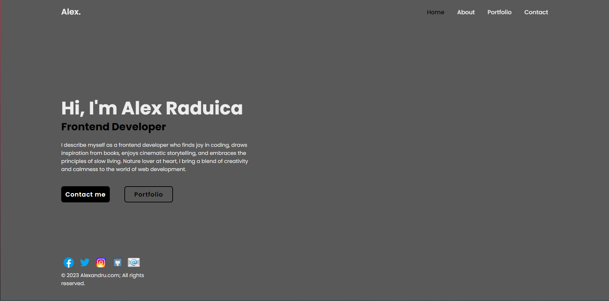

# My Resume Website

Welcome to the repository for my personal resume website! This website is a showcase of my skills, experience, and projects. It was built using only HTML and CSS.

## Table of Contents
- [Demo](#demo)
- [Features](#features)
- [Getting Started](#getting-started)

## Demo

You can check out the live demo of the website [(https://alex-raduica.netlify.app)](#).

[](#)

## Features

- **Clean and Responsive Design:** The website is designed to be visually appealing and responsive on various devices.

- **HTML and CSS Only:** This project uses only HTML and CSS, making it lightweight and easy to understand.

- **Resume Sections:** Clearly organized sections for your personal information, education, work experience, skills, and projects.

- **Easy to Customize:** The code is well-structured and commented, making it simple to customize with your own information.

## Getting Started

1. **Clone the Repository:**
   ```bash
   git clone https://github.com/your-username/resume-website.git
